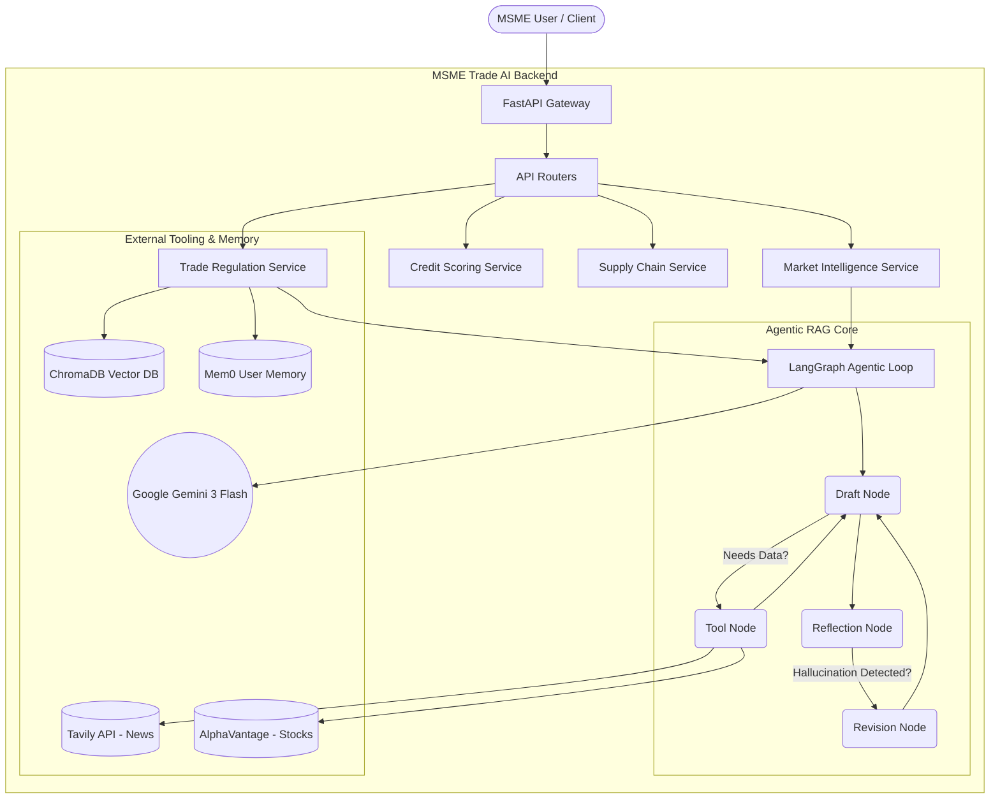
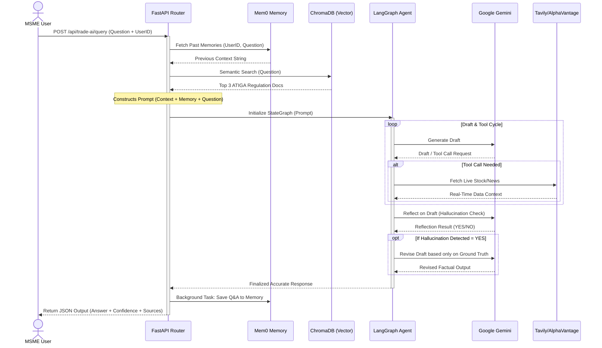

# 🚀 MSME Trade AI Platform (Backend)

The backend powering the **BorneoHack MSME Trade AI Platform**. This project is built to empower Micro, Small, and Medium Enterprises (MSMEs) in Southeast Asia to navigate cross-border trade, secure alternative credit, and optimize their supply chains through Agentic AI.

## 🏗️ Architecture & Tech Stack



This backend utilizes a highly modular, multi-AI service architecture:

*   **Framework:** `FastAPI` + `Python 3.10+` for high-performance concurrent async endpoints.
*   **Core LLM:** Google `gemini-3-flash-preview` (Configured with Tenacity Exponential Backoff for 503 error handling).
*   **Agentic Orchestration:** `LangGraph` + `LangChain` to construct stateful cyclical AI reasoning (Draft &rarr; Action &rarr; Reflect &rarr; Revise).
*   **Real-Time Tooling:** Integrated APIs for live web search (`Tavily`) and live stock/forex pricing (`AlphaVantage`).
*   **Vector Database (RAG):** Embedded `ChromaDB` for instant semantic retrieval of complex ASEAN Trade Regulations (ATIGA).
*   **Agentic Memory:** `Mem0 (v2)` for persistent User IDs, allowing the AI to organically remember context across multiple queries without blowing up token windows.
*   **Model Context Protocol (MCP):** Server-Sent Events (SSE) integration using `FastMCP` to cleanly expose backend tools to external clients natively.

---

## 🔄 Agentic Execution Flow

Here is the exact sequence diagram of how the AI processes a complex user request (e.g. asking a trade regulation question that requires live data):



---

## 🛠️ Features / AI Modules

The system exposes 6 distinct AI Services:

1.  **Cross-Border Trade Assistant (`/api/trade-ai`)**: Agentic RAG system that pulls rules from ChromaDB, fetches real-time updates from Tavily, generates Trade Invoices/Certificates of Origin, and looks up HS Tariffs.
2.  **Credit Scoring (`/api/credit`)**: AI analyzes non-traditional offline MSME metrics (mobile payments, supplier history) to generate alternative credit scores for the unbanked.
3.  **Supply Chain AI (`/api/supply-chain`)**: Triggers automated re-order points and suggests regional suppliers based on predictive metrics.
4.  **Market Intelligence (`/api/market`)**: In-depth strategy planning, competitor analysis, and dynamic pricing models for cross-border expansion.
5.  **Multi-lingual Translation (`/api/translation`)**: Auto-detects dialects and contextually translates MSME wholesale pitches into target regional languages.
6.  **Executive Dashboard (`/api/dashboard`)**: Aggregates all live MSME data points into actionable insights in seconds.

---

## 🚀 Setup & Installation

### 1. Clone & Setup Virtual Environment

```bash
cd backend
python -m venv venv

# Windows
.\venv\Scripts\activate
# Mac/Linux
source venv/bin/activate
```

### 2. Install Dependencies
```bash
pip install -r requirements.txt
```
*(Dependencies include fastAPI, google-genai, chromadb, mem0ai, langgraph, langchain, mcp, and tavily-python).*

### 3. Environment Variables
Create a `.env` file in the `backend/` root directory using the `.env.example` template:

```env
APP_ENV=development
SECRET_KEY=your_secret_key_here
ALLOWED_ORIGINS=http://localhost:3000

# API Keys
GEMINI_API_KEY=your_gemini_key
GEMINI_MODEL=gemini-3-flash-preview
MEM0_API_KEY=m0-your_mem0_key
TAVILY_API_KEY=tvly-your_tavily_key
ALPHAVANTAGE_API_KEY=your_alphavantage_key
```

### 4. Running the Server

Start Uvicorn to run the internal FastAPI instance:
```bash
uvicorn app.main:app --reload --port 8000
```
> The API will be available at `http://localhost:8000`. You can test endpoints via the Swagger UI directly at `http://localhost:8000/docs`.

---

## 🧪 Testing with Postman

To quickly test all integrations without a frontend, a **Postman Collection (v2.1)** has been pre-configured.

1. Open Postman.
2. Click **Import** and upload the `postman_collection.json` file located in the root of this `backend` repository.
3. Every endpoint is pre-filled with structured mock payloads (e.g. MSME business logic, ATIGA regulation questions). Simply click **Send**!
